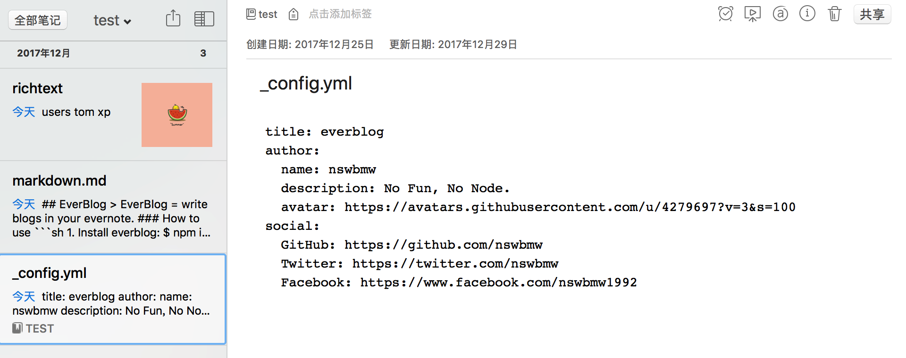
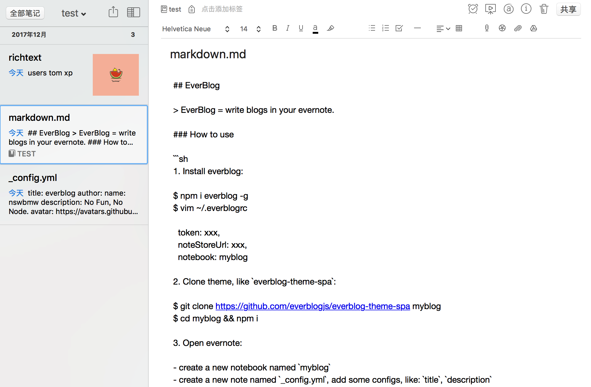

## everblog-theme-spa

SPA theme for [everblog-adaptor-spa](https://github.com/everblogjs/everblog-adaptor-spa).

### Usage

1. create `_config.yml`



2. create `xxx.md`



3. Start everblog

```sh
DEBUG=* everblog start
```


